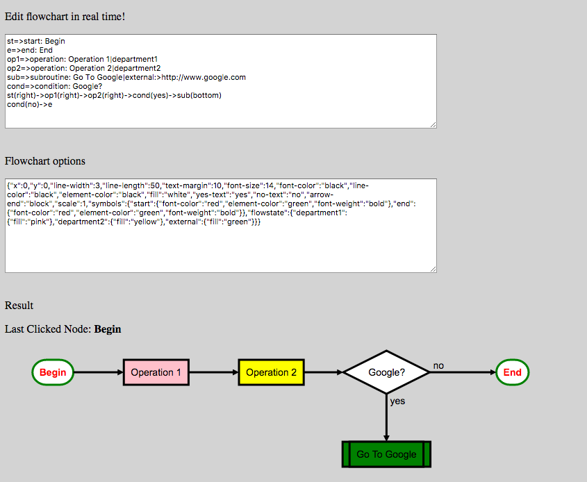

# react-simple-flowchart


The simple React.js flowchart component based on [flowchart.js](https://github.com/adrai/flowchart.js)

## Getting Started

Install it via npm:

```shell
npm install react-simple-flowchart
```

And include in your project:

```javascript
import Flowchart from 'react-simple-flowchart';
```

## Component's Props

### chartCode

It is a required prop. It containes a special code that defines a flowchart structure.
 See [flowchart.js](https://github.com/adrai/flowchart.js) for details.

### options

It is a required prop. It containes options for flowchart elements (colors, line styles, etc).
 See [flowchart.js](https://github.com/adrai/flowchart.js) for details.

### onClick

It is an optional event handler for the onClick event, which occurs when flowchart symbol
 have been clicked. It receives elementText argument that contains text or id of clicked symbol.

  For example, if you use in chartCode:
  ```

  op1=>operation: Operation 1|department1

  ```

  symbol id will be "op1" and symbol text will be "Operation 1". If you will click on symbol
  aside from the text, onClick will receive "op1", but if you will click on text,
   it will receive "Operation 1". Of course, it is not very convenient,
    but unfortunately in flowchart.js text labels are not nested in the symbols and have no ids.
    Therefore, you should include the processing of both text and ids in your code.

 See example below for this prop's usage details.

## React.js (ES6) usage example:

```javascript
import React, { Component } from 'react';
import Flowchart from 'react-simple-flowchart';


export class Flowdemo extends Component {

  constructor(props) {
    super(props);
    const code =
      `st=>start: Begin
e=>end: End
op1=>operation: Operation 1|department1
op2=>operation: Operation 2|department2
sub=>subroutine: Go To Google|external:>http://www.google.com
cond=>condition: Google?
st(right)->op1(right)->op2(right)->cond(yes)->sub(bottom)
cond(no)->e`;

    const opt = {
      x: 0,
      y: 0,
      'line-width': 3,
      'line-length': 50,
      'text-margin': 10,
      'font-size': 14,
      'font-color': 'black',
      'line-color': 'black',
      'element-color': 'black',
      fill: 'white',
      'yes-text': 'yes',
      'no-text': 'no',
      'arrow-end': 'block',
      scale: 1,
      symbols: {
        start: {
          'font-color': 'red',
          'element-color': 'green',
          'font-weight': 'bold',
        },
        end: {
          'font-color': 'red',
          'element-color': 'green',
          'font-weight': 'bold',
        },
      },
      flowstate: {
        department1: { fill: 'pink' },
        department2: { fill: 'yellow' },
        external: { fill: 'green' },
      },
    };

    this.state = {
      code,
      opt,
      elementText: 'none',
    }
  }

  handleCodeChange(e) {
    this.setState({
      code: e.target.value,
    });

  }

  handleOptChange(e) {
    this.setState({
      opt: JSON.parse(e.target.value),
    });

  }

  render() {
    const { code, opt, elementText } = this.state;
    return (
      <div>
        <p>Edit flowchart in real time!</p>
        <textarea
          cols="100"
          rows="10"
          value={code}
          onChange={(e) => this.handleCodeChange(e)}
        />
        <br /><br />
        <p>Flowchart options</p>
        <textarea cols="100"
                  rows="10"
                  value={JSON.stringify(opt)}
                  onChange={(e) => this.handleOptChange(e)}
        />
        <br /><br />
        <p>Result</p>
        <p>Last Clicked Node: <strong>{elementText}</strong></p>
        <Flowchart
          chartCode={code}
          options={opt}
          onClick={elementText => this.setState({elementText})}
        />
      </div>
    );
  }
}

```

See and try this example at [CodeSandbox](https://codesandbox.io/s/react-simple-flowchart-example-jbm2u?file=/src/Flowdemo.js:0-2290)

It will be looks as below:



See [flowchart.js](https://github.com/adrai/flowchart.js) to learn more about flowchart and options syntax.

## License

MIT
